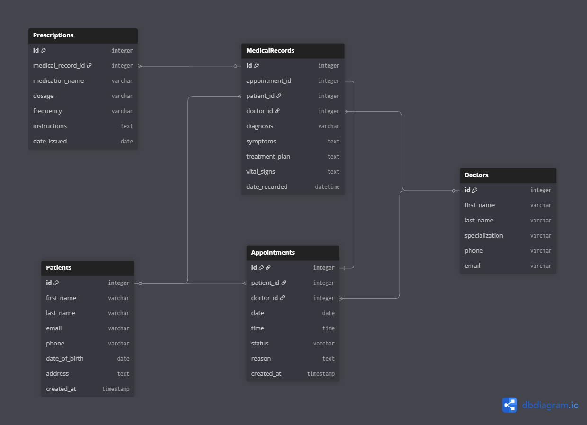
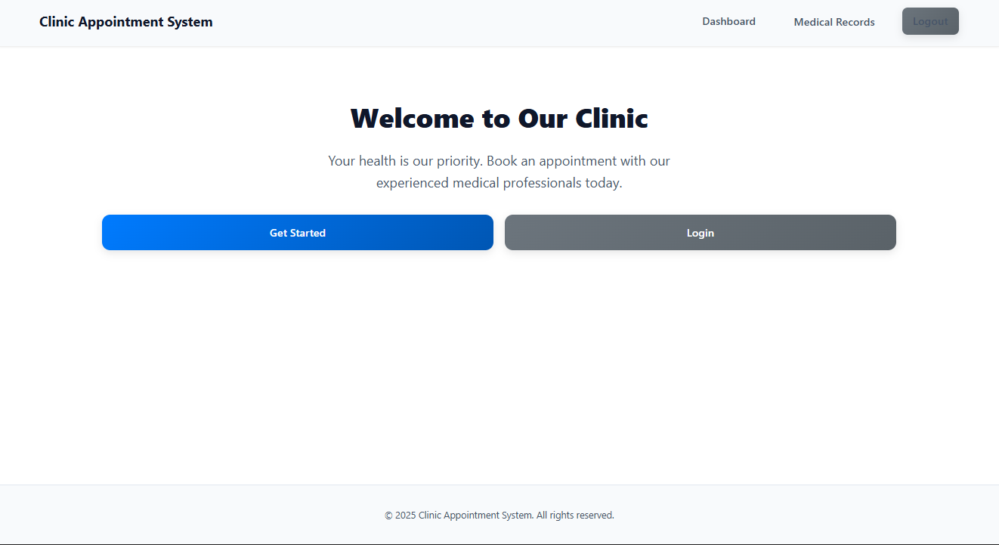
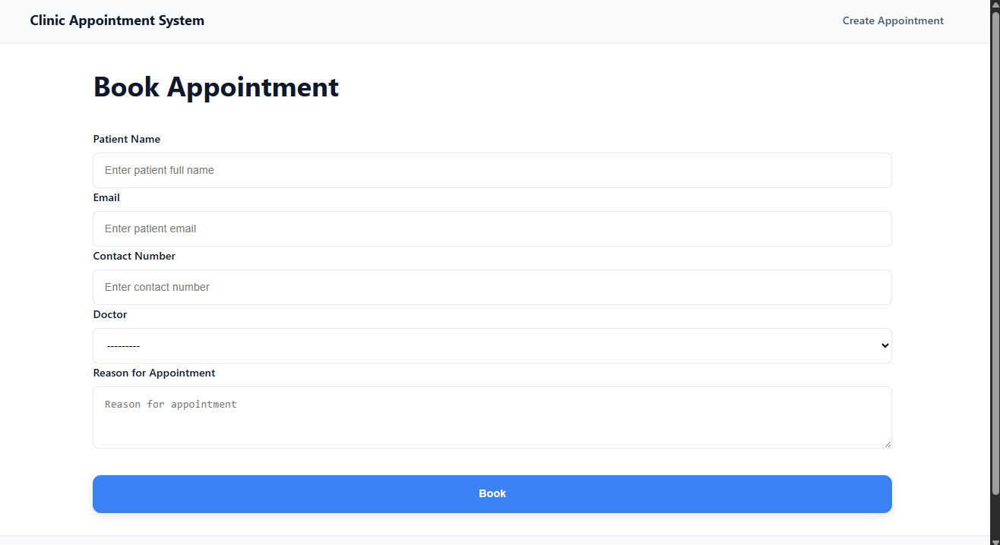
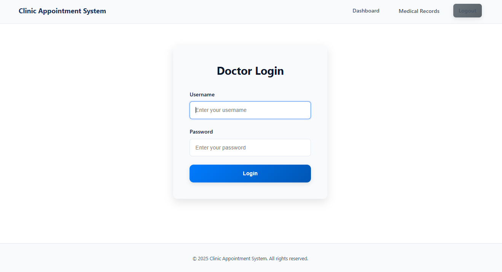
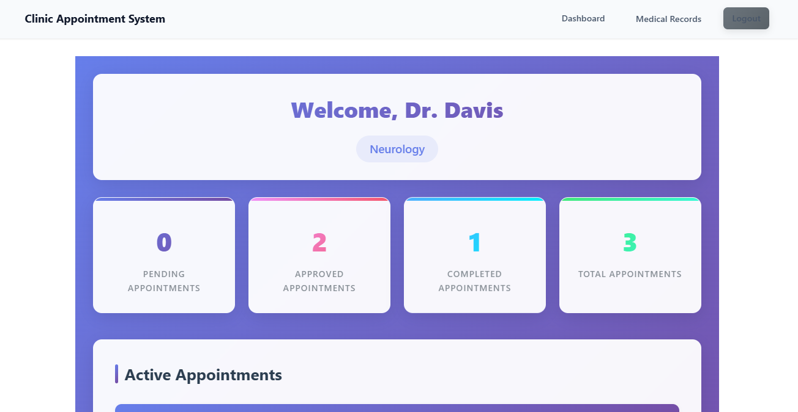
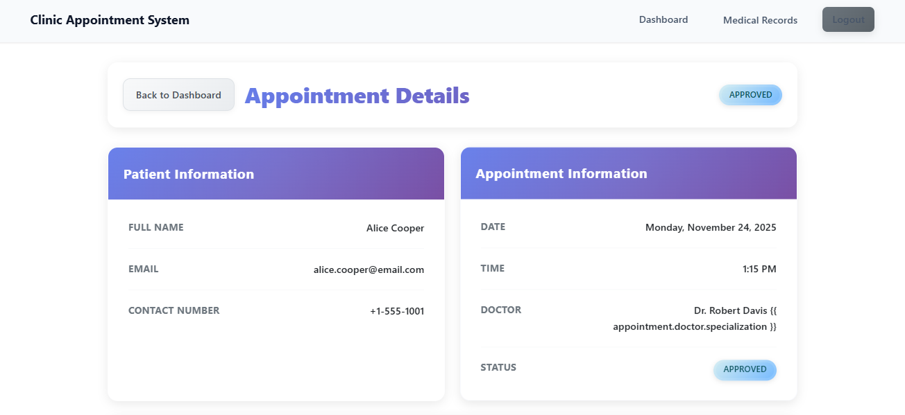
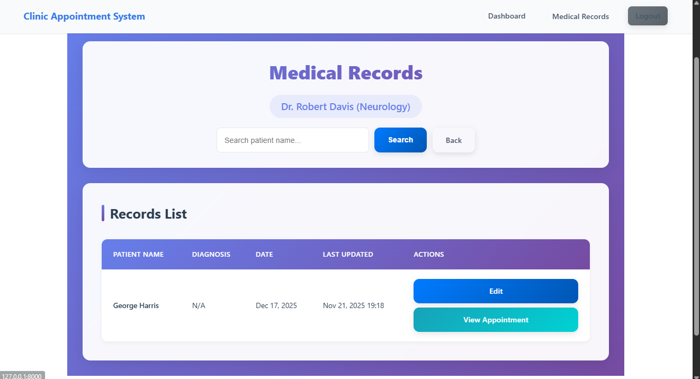
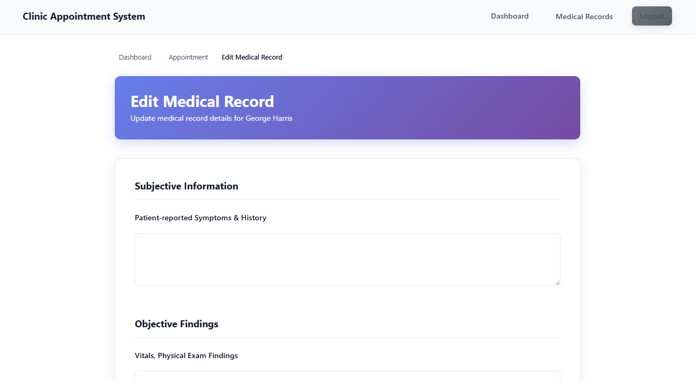
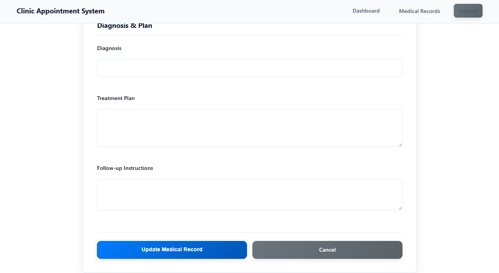
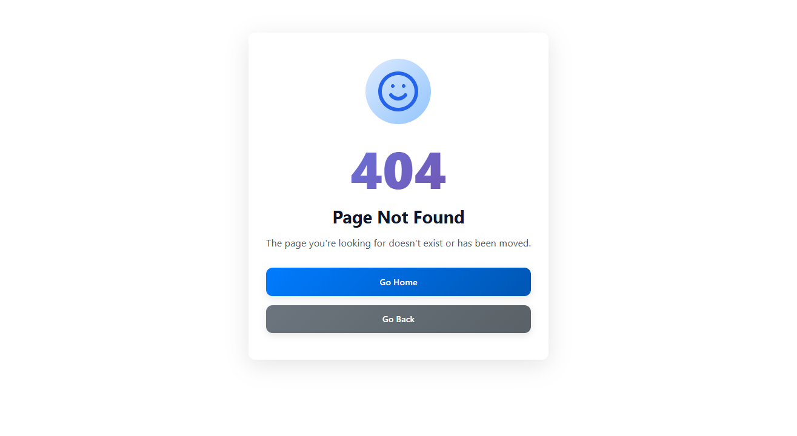

# Clinic Appointment System

A comprehensive web-based clinic appointment management system built with Django. This application streamlines the process of booking, managing, and tracking medical appointments for both patients and healthcare providers.

## Table of Contents

- [Overview](#overview)
- [Features](#features)
- [Technology Stack](#technology-stack)
- [Project Architecture](#project-architecture)
- [Installation](#installation)
- [Configuration](#configuration)
- [Usage](#usage)
- [Project Structure](#project-structure)
- [Database Schema](#database-schema)
- [API Endpoints](#api-endpoints)

## Overview

The Clinic Appointment System is designed to digitize and automate the appointment booking process for medical clinics. It provides a user-friendly interface for patients to book appointments, view their appointment history, and manage their profiles, while giving clinic staff and doctors powerful tools to manage schedules, patient records, and appointments.

## Features

### Patient Features

- **User Registration & Authentication**: Secure signup and login system
- **Appointment Booking**: Browse available time slots and book appointments
- **Appointment Management**: View, reschedule, or cancel appointments
- **Profile Management**: Update personal information and contact details
- **Appointment History**: Track past and upcoming appointments
- **Real-time Availability**: Check doctor availability in real-time

### Admin/Staff Features

- **Dashboard**: Overview of appointments, patients, and clinic statistics
- **Doctor Management**: Add, edit, and manage doctor profiles and specializations
- **Appointment Management**: View, approve, reschedule, or cancel appointments
- **Patient Records**: Access and manage patient information
- **Schedule Management**: Configure doctor availability and working hours
- **Reporting**: Generate reports on appointments and clinic operations

### System Features

- **Responsive Design**: Works seamlessly on desktop, tablet, and mobile devices
- **Error Handling**: Custom 404 and 500 error pages
- **Security**: CSRF protection, secure authentication, and authorization
- **Email Notifications**: Automated appointment confirmations and reminders
- **Search & Filter**: Advanced search capabilities for appointments and patients

## Tech Stack

### Backend

- **Framework**: Django 4.x
- **Language**: Python 3.8+
- **Database**: SQLite (development) / PostgreSQL (production ready)
- **Authentication**: Django Authentication System

### Frontend

- **HTML5**: Semantic markup
- **CSS3**: Custom styling with responsive design
- **JavaScript**: Vanilla JS for interactivity
- **Templates**: Django Template Language

### Development Tools

- **Version Control**: Git
- **Package Management**: pip

## Project Architecture

### High-Level Architecture

```
┌─────────────┐         ┌─────────────┐         ┌─────────────┐
│   Browser   │ ◄─────► │   Django    │ ◄─────► │  Database   │
│  (Client)   │         │   Server    │         │   (SQLite)  │
└─────────────┘         └─────────────┘         └─────────────┘
                               │
                               ▼
                        ┌─────────────┐
                        │   Static    │
                        │   Files     │
                        └─────────────┘
```

### Django App Architecture

The project follows Django's MVT (Model-View-Template) pattern:

```
clinic_project/
├── clinic_app/                 # Main Django application
│   ├── models.py              # Database models (M)
│   ├── views.py               # Business logic (V)
│   ├── templates/             # HTML templates (T)
│   ├── static/                # CSS, JS, images
│   ├── forms.py               # Form definitions
│   ├── urls.py                # URL routing
│   └── admin.py               # Admin configuration
├── clinic_project/            # Project settings
│   ├── settings.py            # Configuration
│   ├── urls.py                # Root URL configuration
│   └── wsgi.py                # WSGI application
└── manage.py                  # Django management script
```

### Key Components

#### Models (Data Layer)

- **User**: Extended Django user model for authentication
- **Doctor**: Doctor profiles with specializations
- **Patient**: Patient information and medical history
- **Appointment**: Appointment scheduling and tracking
- **TimeSlot**: Available time slots for appointments
- **Specialization**: Medical specializations

#### Views (Business Logic Layer)

- **Class-Based Views**: For CRUD operations
- **Function-Based Views**: For specific business logic
- **Mixins**: LoginRequiredMixin, UserPassesTestMixin for authorization

#### Templates (Presentation Layer)

- **Base Template**: Common layout and navigation
- **Component Templates**: Reusable UI components
- **Error Templates**: Custom 404 and 500 pages
- **Form Templates**: User input forms

## Usage

### For Patients

1. **Register**: Create a new account at `/register`
2. **Login**: Access your account at `/login`
3. **Book Appointment**: Navigate to "Book Appointment" and select:
   - Doctor
   - Date
   - Available time slot
4. **Manage Appointments**: View and manage appointments from your dashboard
5. **Update Profile**: Keep your contact information current

### For Admins

1. **Access Admin Panel**: Navigate to `/admin`
2. **Manage Doctors**: Add or edit doctor profiles and specializations
3. **Manage Appointments**: View all appointments and their statuses
4. **Manage Patients**: Access patient records and information
5. **Configure Settings**: Set clinic hours, holidays, and system settings

## Project Structure

```
clinic-appointment-system/
├── clinic_project/
│   ├── clinic_app/
│   │   ├── migrations/              # Database migrations
│   │   ├── static/
│   │   │   ├── css/
│   │   │   │   └── styles.css      # Main stylesheet
│   │   │   ├── js/
│   │   │   │   └── scripts.js      # JavaScript files
│   │   │   └── images/             # Image assets
│   │   ├── templates/
│   │   │   └── clinic_app/
│   │   │       ├── base.html       # Base template
│   │   │       ├── home.html       # Homepage
│   │   │       ├── appointments/   # Appointment templates
│   │   │       ├── auth/           # Authentication templates
│   │   │       └── errors/         # Error page templates
│   │   ├── admin.py                # Admin configuration
│   │   ├── apps.py                 # App configuration
│   │   ├── forms.py                # Form definitions
│   │   ├── models.py               # Database models
│   │   ├── urls.py                 # URL patterns
│   │   └── views.py                # View functions/classes
│   ├── clinic_project/
│   │   ├── settings.py             # Project settings
│   │   ├── urls.py                 # Root URL configuration
│   │   └── wsgi.py                 # WSGI configuration
│   ├── media/                      # User-uploaded files
│   ├── static/                     # Collected static files
│   ├── db.sqlite3                  # SQLite database
│   └── manage.py                   # Django management script
├── venv/                           # Virtual environment
├── .gitignore                      # Git ignore rules
├── requirements.txt                # Python dependencies
└── README.md                       # This file
```

## Database Schema

### Core Models

The system uses the following database structure to manage clinic operations:



## API Endpoints

### Authentication

- `POST /register/` - User registration
- `POST /login/` - User login
- `POST /logout/` - User logout

### Appointments

- `GET /appointments/` - List all appointments
- `GET /appointments/new/` - Appointment booking form
- `POST /appointments/create/` - Create new appointment
- `GET /appointments/<id>/` - View appointment details
- `PUT /appointments/<id>/edit/` - Update appointment
- `DELETE /appointments/<id>/cancel/` - Cancel appointment

### Doctors

- `GET /doctors/` - List all doctors
- `GET /doctors/<id>/` - View doctor profile
- `GET /doctors/<id>/availability/` - Check doctor availability

### Profile

- `GET /profile/` - View user profile
- `PUT /profile/edit/` - Update profile

## Screenshots












---
